# Mermaid Lens: every diagram type

Open this file on github.com with Mermaid Lens installed. Hover a diagram to open the viewer toolbar.

Generated from `test/fixtures/all-types.mjs` by `npm run sample:md -w mermaid-lens`; edit the fixture, not this file.

## Common GitHub examples

### Flowchart

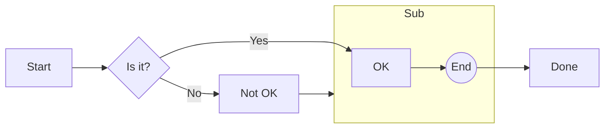
```mermaid
flowchart LR
  A[Start] --> B{Is it?}
  B -->|Yes| C[OK]
  B -- No --> D[Not OK]
  subgraph sub_1 [Sub]
    C --> E((End))
  end
  D --> sub_1
  E --> F[Done]
```

### Sequence diagram

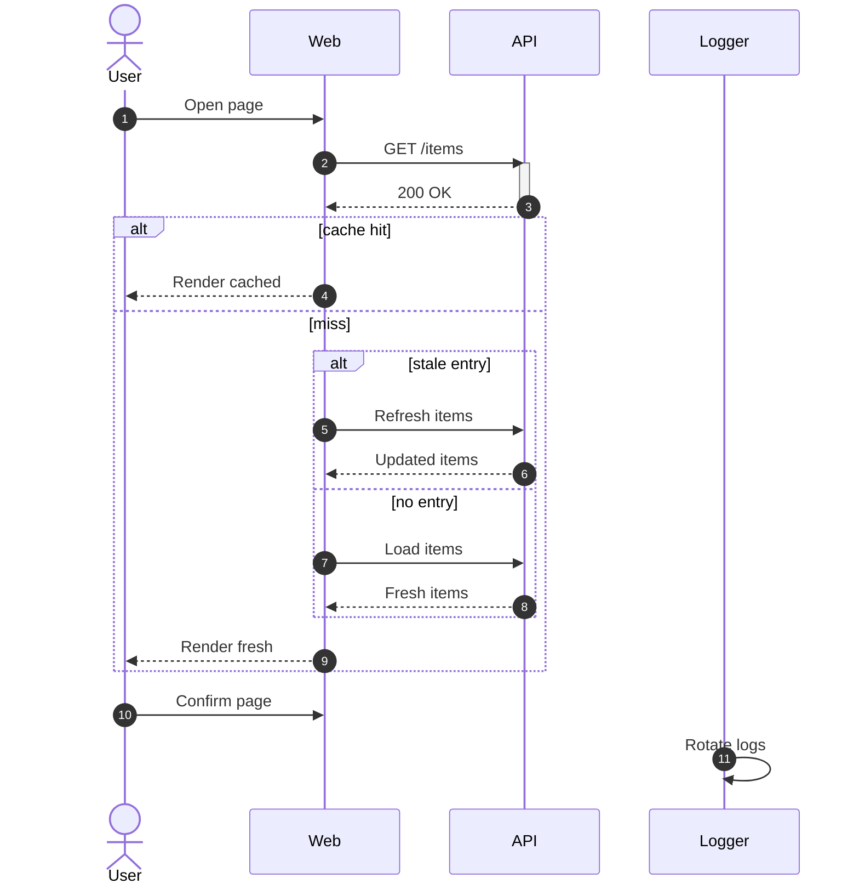
```mermaid
sequenceDiagram
  autonumber
  actor U as User
  participant W as Web
  participant A as API
  participant L as Logger
  U->>W: Open page
  W->>A: GET /items
  activate A
  A-->>W: 200 OK
  deactivate A
  alt cache hit
    W-->>U: Render cached
  else miss
    alt stale entry
      W->>A: Refresh items
      A-->>W: Updated items
    else no entry
      W->>A: Load items
      A-->>W: Fresh items
    end
    W-->>U: Render fresh
  end
  U->>W: Confirm page
  L->>L: Rotate logs
```

### Class diagram

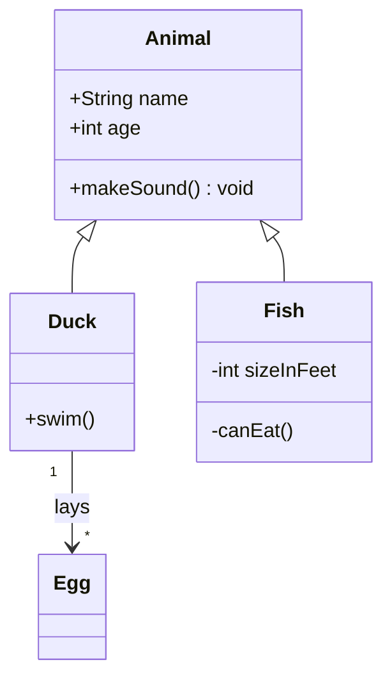
```mermaid
classDiagram
  class Animal {
    +String name
    +int age
    +makeSound() void
  }
  class Duck {
    +swim()
  }
  class Fish {
    -int sizeInFeet
    -canEat()
  }
  Animal <|-- Duck
  Animal <|-- Fish
  Duck "1" --> "*" Egg : lays
```

### State diagram

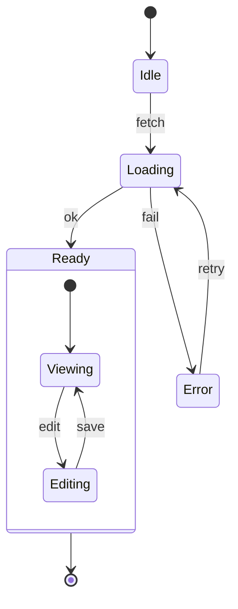
```mermaid
stateDiagram-v2
  [*] --> Idle
  Idle --> Loading : fetch
  Loading --> Ready : ok
  Loading --> Error : fail
  Error --> Loading : retry
  state Ready {
    [*] --> Viewing
    Viewing --> Editing : edit
    Editing --> Viewing : save
  }
  Ready --> [*]
```

### Entity relationship diagram

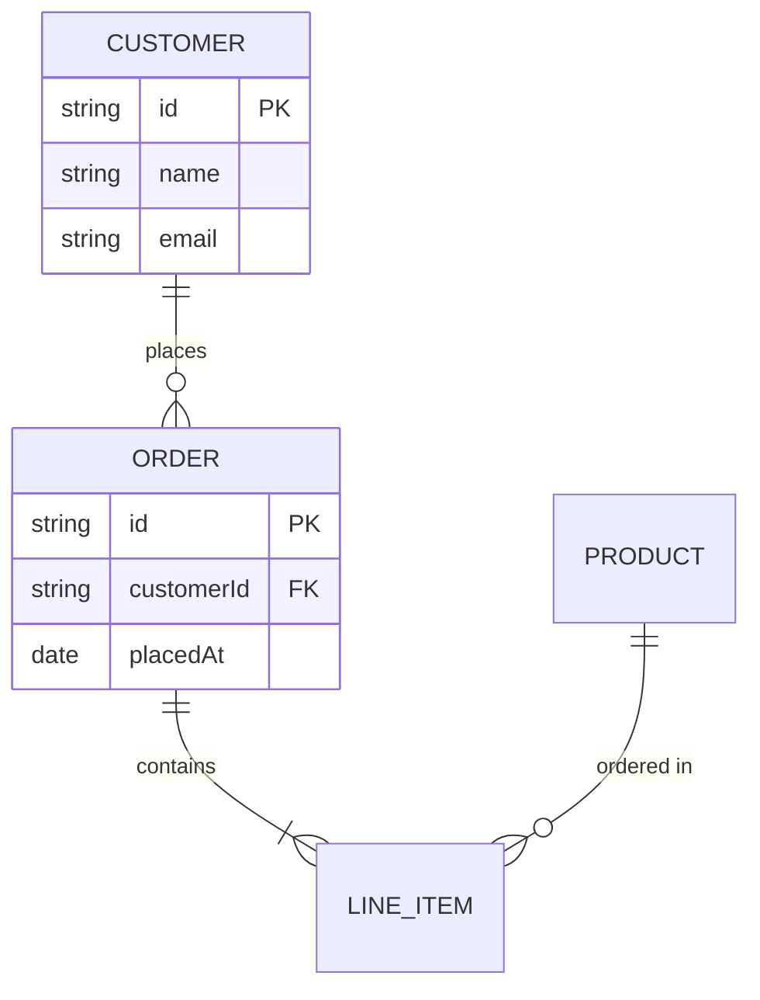
```mermaid
erDiagram
  CUSTOMER ||--o{ ORDER : places
  ORDER ||--|{ LINE_ITEM : contains
  PRODUCT ||--o{ LINE_ITEM : "ordered in"
  CUSTOMER {
    string id PK
    string name
    string email
  }
  ORDER {
    string id PK
    string customerId FK
    date placedAt
  }
```

### User journey

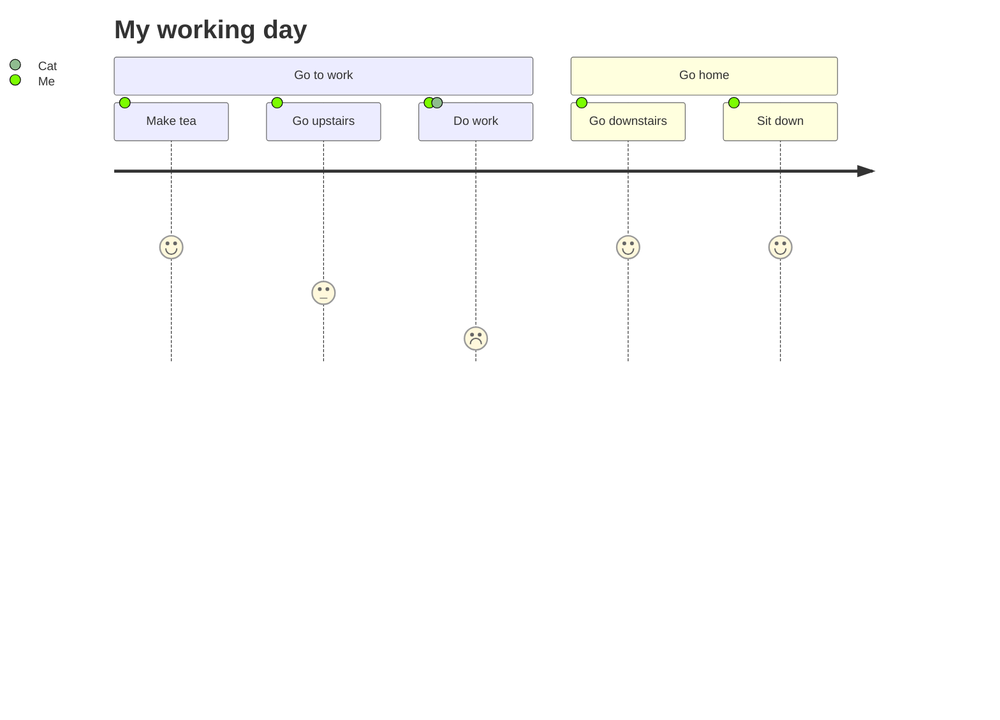
```mermaid
journey
  title My working day
  section Go to work
    Make tea: 5: Me
    Go upstairs: 3: Me
    Do work: 1: Me, Cat
  section Go home
    Go downstairs: 5: Me
    Sit down: 5: Me
```

### Gantt chart

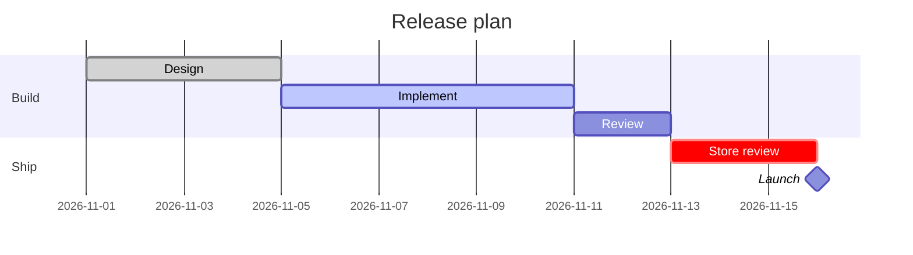
```mermaid
gantt
  title Release plan
  dateFormat YYYY-MM-DD
  section Build
    Design        :done,    des, 2026-11-01, 4d
    Implement     :active,  imp, after des, 6d
    Review        :         rev, after imp, 2d
  section Ship
    Store review  :crit,    sr, after rev, 3d
    Launch        :milestone, after sr, 0d
```

### Pie chart

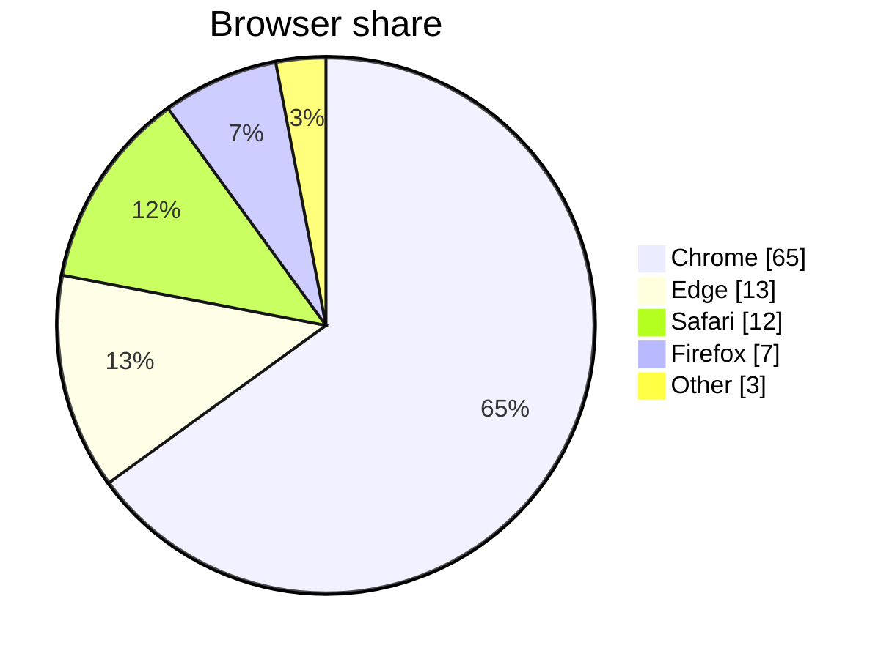
```mermaid
pie showData
  title Browser share
  "Chrome" : 65
  "Edge" : 13
  "Safari" : 12
  "Firefox" : 7
  "Other" : 3
```

### Quadrant chart

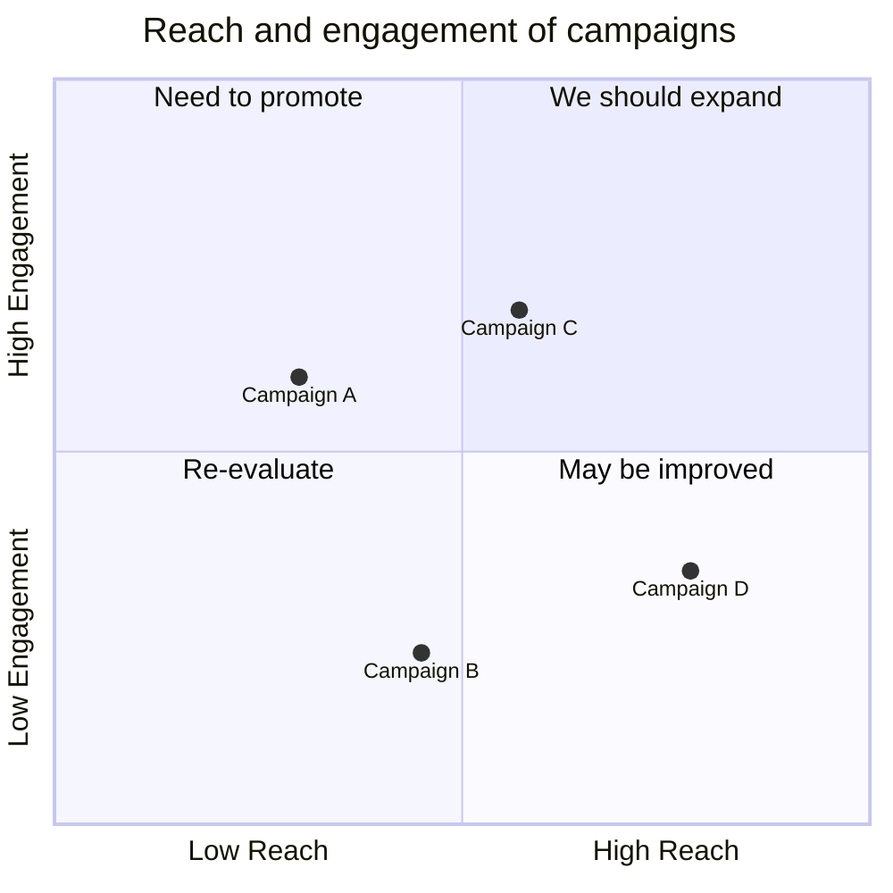
```mermaid
quadrantChart
  title Reach and engagement of campaigns
  x-axis Low Reach --> High Reach
  y-axis Low Engagement --> High Engagement
  quadrant-1 We should expand
  quadrant-2 Need to promote
  quadrant-3 Re-evaluate
  quadrant-4 May be improved
  Campaign A: [0.3, 0.6]
  Campaign B: [0.45, 0.23]
  Campaign C: [0.57, 0.69]
  Campaign D: [0.78, 0.34]
```

### Requirement diagram

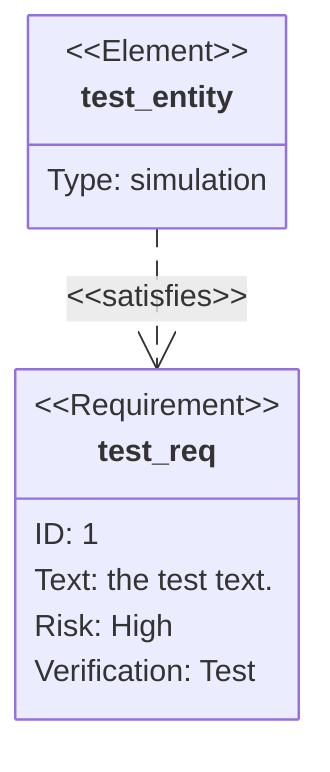
```mermaid
requirementDiagram
  requirement test_req {
    id: 1
    text: the test text.
    risk: high
    verifymethod: test
  }
  element test_entity {
    type: simulation
  }
  test_entity - satisfies -> test_req
```

### Git graph

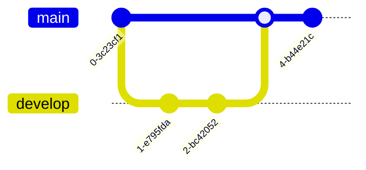
```mermaid
gitGraph
  commit
  branch develop
  checkout develop
  commit
  commit
  checkout main
  merge develop
  commit
```

### C4 context diagram

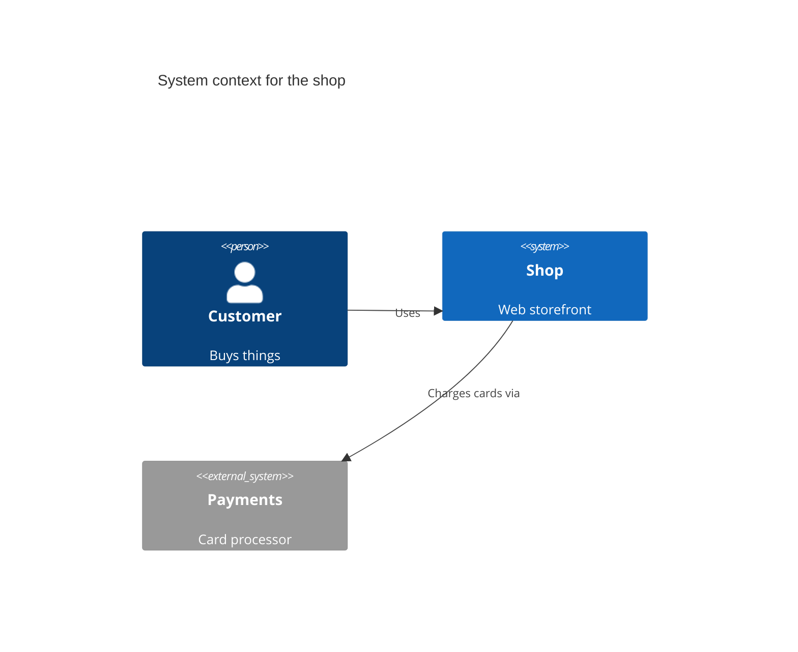
```mermaid
C4Context
  title System context for the shop
  Person(customer, "Customer", "Buys things")
  System(shop, "Shop", "Web storefront")
  System_Ext(pay, "Payments", "Card processor")
  Rel(customer, shop, "Uses")
  Rel(shop, pay, "Charges cards via")
```

### Mindmap

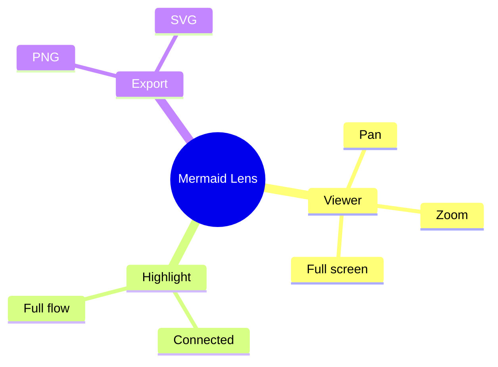
```mermaid
mindmap
  root((Mermaid Lens))
    Viewer
      Pan
      Zoom
      Full screen
    Highlight
      Connected
      Full flow
    Export
      PNG
      SVG
```

### Timeline

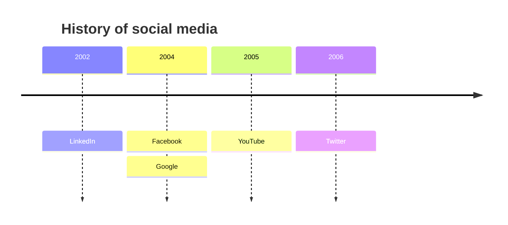
```mermaid
timeline
  title History of social media
  2002 : LinkedIn
  2004 : Facebook : Google
  2005 : YouTube
  2006 : Twitter
```

### Sankey diagram

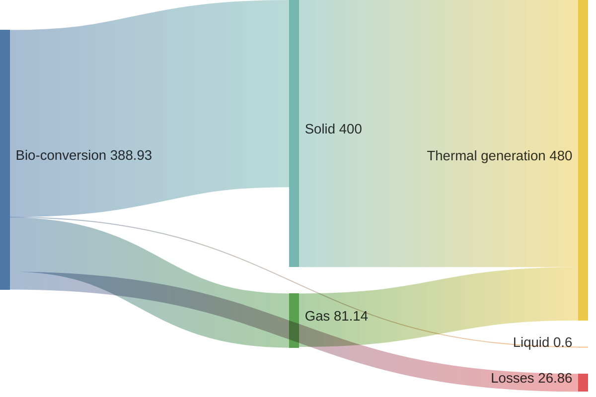
```mermaid
sankey-beta

Bio-conversion,Liquid,0.597
Bio-conversion,Losses,26.862
Bio-conversion,Solid,280.322
Bio-conversion,Gas,81.144
Solid,Thermal generation,400
Gas,Thermal generation,80
```

### XY chart

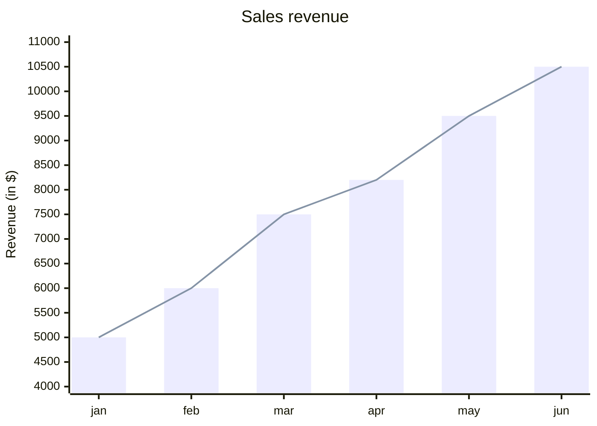
```mermaid
xychart-beta
  title "Sales revenue"
  x-axis [jan, feb, mar, apr, may, jun]
  y-axis "Revenue (in $)" 4000 --> 11000
  bar [5000, 6000, 7500, 8200, 9500, 10500]
  line [5000, 6000, 7500, 8200, 9500, 10500]
```

### Block diagram

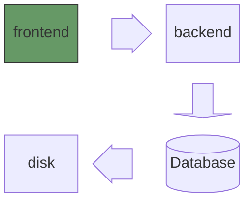
```mermaid
block-beta
  columns 3
  frontend blockArrowId6<["&nbsp;&nbsp;&nbsp;"]>(right) backend
  space:2 down<["&nbsp;&nbsp;&nbsp;"]>(down)
  disk left<["&nbsp;&nbsp;&nbsp;"]>(left) database[("Database")]
  classDef front fill:#696,stroke:#333;
  class frontend front
```

### Packet diagram

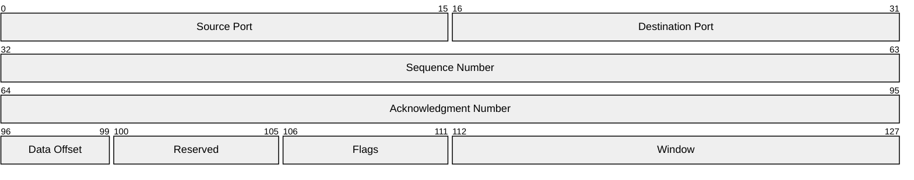
```mermaid
packet-beta
  0-15: "Source Port"
  16-31: "Destination Port"
  32-63: "Sequence Number"
  64-95: "Acknowledgment Number"
  96-99: "Data Offset"
  100-105: "Reserved"
  106-111: "Flags"
  112-127: "Window"
```

### Kanban

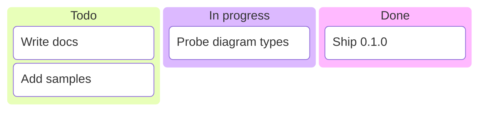
```mermaid
kanban
  todo[Todo]
    t1[Write docs]
    t2[Add samples]
  doing[In progress]
    t3[Probe diagram types]
  done[Done]
    t4[Ship 0.1.0]
```

### Architecture diagram

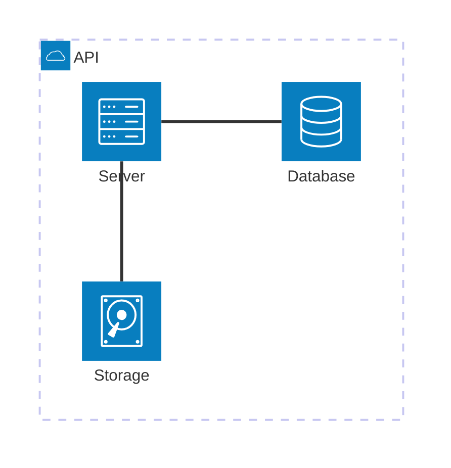
```mermaid
architecture-beta
  group api(cloud)[API]
  service db(database)[Database] in api
  service disk1(disk)[Storage] in api
  service server(server)[Server] in api
  db:L -- R:server
  disk1:T -- B:server
```

### Radar chart

```mermaid
radar-beta
  title Skills
  axis a["Design"], b["Code"], c["Test"], d["Docs"], e["Ops"]
  curve x["Alice"]{4, 5, 3, 2, 4}
  curve y["Bob"]{3, 2, 5, 4, 3}
  max 5
```

### Treemap

```mermaid
treemap-beta
"Products"
    "Electronics"
        "Phones": 50
        "Laptops": 30
    "Clothing"
        "Shirts": 20
        "Shoes": 25
```

### Mermaid version

```mermaid
info
```

### Hand-drawn look + init directive

```mermaid
---
title: Hand drawn
config:
  look: handDrawn
---
flowchart LR
  A[Idea] --> B[Sketch] --> C[Ship]
```

## More examples

Mermaid Lens uses its bundled Mermaid 12.3 and ZenUML renderers. GitHub may show a render error for newer syntax when the extension is disabled.

### Venn diagram

```mermaid
venn-beta
  title Overlap
  set A["Frontend"]
  set B["Backend"]
  union A,B["Full stack"]
```

### Ishikawa (fishbone)

```mermaid
ishikawa
  Slow page load
    People
      No perf budget
    Process
      No profiling in CI
    Technology
      Large bundle
      Uncached API
```

### Wardley map

```mermaid
wardley-beta
  title Tea shop
  anchor Business [0.95, 0.63]
  component Cup of Tea [0.79, 0.61]
  component Tea [0.63, 0.81]
  component Hot Water [0.52, 0.80]
  Business -> Cup of Tea
  Cup of Tea -> Tea
  Cup of Tea -> Hot Water
```

### Tree view

```mermaid
treeView-beta
  src
    enhancer
      index.ts
      viewer.ts
    detector.ts
```

### Swimlanes

```mermaid
swimlane-beta LR
  subgraph Design
    Draft[Draft mockup]
  end
  subgraph Engineering
    Build[Build screen]
    Review[Review implementation]
  end
  Draft --> Build --> Review
```

### UML use case

```mermaid
usecase-beta
  actor Reader
  Browse("Browse catalogue")
  Save("Save a title")
  Reader --> Browse
  Reader --> Save
```

### Event modeling

```mermaid
eventmodeling
  tf 01 ui LoanForm
  tf 02 cmd BorrowBook
  tf 03 evt BookBorrowed
```

### Cynefin framework

```mermaid
cynefin-beta
  title Improving search
  clear
    "Fix a broken link"
  complicated
    "Tune query performance"
  complex
    "Learn what readers search for"
  chaotic
    "Restore the search service"
```

### Agentflow

```mermaid
---
title: Book recommendations
---
%% A simple recommendation flow
agentflow LR
  A([Start]) --> B[Read the request]
  B --> C[Suggest a title]
  C --> D([Done])
```

### Railroad diagram

```mermaid
railroad-beta
  greeting = sequence(terminal("hello"), choice(terminal("reader"), terminal("writer")));
```

### Railroad diagram (EBNF)

```mermaid
railroad-ebnf-beta
  integer = [ sign ], digit, { digit };
  sign = "+" | "-";
  digit = "0" | "1";
```

### Railroad diagram (ABNF)

```mermaid
railroad-abnf-beta
  word = 1*letter;
  letter = %x41-5A / %x61-7A;
```

### Railroad diagram (PEG)

```mermaid
railroad-peg-beta
  Answer <- "yes" / "no";
```

### ZenUML

```mermaid
zenuml
  Alice->Bob: Hello
  Bob->Alice: Hi
```

### Flowchart with ELK layout

```mermaid
---
config:
  layout: elk
---
flowchart TD
  A --> B --> C
  A --> C
```
